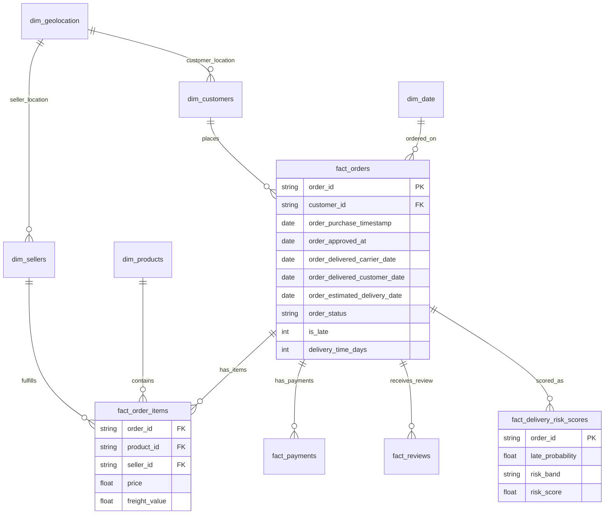

<div align="center">

# 🛒 Olist Brazilian E-Commerce Analytics

### Delivery Risk, Customer Experience, Revenue Intelligence & Predictive Operations

<p>
  
  
  
  
</p>

<p>
  <b>99,441 orders</b> · <b>R$13.59M revenue</b> · <b>7.9% late-delivery rate</b> · <b>4.07 average review score</b>
</p>


</div>

---

## 📌 Project Overview

**Olist Brazilian E-Commerce Analytics** is an end-to-end data analytics project built on the Brazilian Olist marketplace dataset. The project analyzes customer orders, payments, products, sellers, delivery performance, reviews, and geography to generate business insights and predict late-delivery risk.

The goal is to help marketplace, logistics, customer experience, and operations teams answer one high-value business question:

> **Which orders, states, categories, and operational patterns create the highest delivery-risk and customer-experience impact?**

This project delivers a complete analytics workflow covering:

- Data cleaning and multi-table integration
- Exploratory data analysis
- SQL-based business analytics
- Late-delivery risk modeling
- Power BI-ready star schema
- Excel reporting outputs
- Executive recommendations

### Executive Summary

| KPI | Value |
|---|---:|
| Total orders | **99,441** |
| Delivered orders | **96,478** |
| Late delivery rate | **7.9%** |
| Total revenue | **R$ 13,591,644** |
| Average order value | **R$ 137.75** |
| Average review score | **4.07 / 5** |
| Average delivery time | **12.6 days** |
| Best predictive model | **RandomForest** |
| Model ROC-AUC | **0.733** |

---

## 💼 Business Impact


This project converts marketplace order data into an operational decision-support layer for improving delivery reliability, customer satisfaction, and logistics prioritization.

### Key Business Outcomes

- Measured marketplace scale across **99,441 orders** and **R$13.59M** in revenue.
- Quantified delivery reliability with a **7.9% late-delivery rate**.
- Connected delivery performance to customer satisfaction using review-score patterns.
- Identified delivery-risk signals across **state, product category, freight burden, order complexity, approval delays, weekday, hour, and installments**.
- Built a **RandomForest late-delivery prediction model** with **ROC-AUC 0.733**.
- Created scored order outputs for proactive exception queues and logistics intervention.
- Prepared star-schema exports and DAX-ready metrics for Power BI reporting.

### Recommended Actions

| Recommendation | Business Value |
|---|---|
| Prioritize high-risk states and categories | Focus logistics resources where SLA risk is highest |
| Monitor freight ratio and approval delay | Use early warning signals before delivery SLA breaches |
| Use daily risk scoring | Create proactive exception queues for logistics teams |
| Link delivery KPIs with review recovery workflows | Reduce negative customer experience after late delivery |
| Track seller/customer geography | Identify cross-state fulfillment risk patterns |

---

## 🧱 Project Structure

```text
OLIST-BRAZILIAN-ECOMMERCE-ANALYTICS/
│
├── data/
│   ├── raw/                              # Original Olist CSV files
│   ├── processed/                        # Cleaned and integrated datasets
│   └── exports/                          # Analytics-ready master and scored outputs
│
├── notebooks/
│   ├── 01_data_cleaning_eda.ipynb         # Data validation, cleaning and EDA
│   ├── 02_sql_analytics.ipynb             # SQL analysis and business queries
│   ├── 03_feature_engineering.ipynb       # Delivery-risk feature creation
│   └── 04_modeling_scoring.ipynb          # Late-delivery model and scoring
│
├── src/
│   ├── data_preparation.py                # Cleaning and join logic
│   ├── feature_engineering.py             # Risk features and transformations
│   ├── train_model.py                     # Model training and evaluation
│   ├── score_orders.py                    # Late-risk scoring pipeline
│   └── run_pipeline.py                    # End-to-end execution script
│
├── outputs/
│   ├── dashboard.html                     # Interactive HTML dashboard
│   ├── Olist_Analysis_Workbook.xlsx       # Excel reporting workbook
│   ├── master_orders.csv                  # Analytics-ready master table
│   ├── scored_delivered_orders.csv        # Scored orders for intervention
│   ├── figures/                           # Chart assets
│   ├── sql/                               # SQL scripts and reusable queries
│   └── powerbi/                           # Star-schema extracts and DAX measures
│
├── powerbi/
│   ├── DATA_MODEL.md                      # Relationship documentation
│   ├── MEASURES.dax                       # Delivery, revenue and CX DAX measures
│   └── star_schema_exports/               # Power BI-ready CSV tables
│
├── reports/
│   └── Report.md                          # Executive markdown report
│
├── assets/
│   └── images/                            # README visuals
│
├── requirements.txt
└── README.md
```

---

## 🗄️ Database Schema — Star Schema

The analytics model is designed as a **star schema** to support SQL analytics, Power BI dashboards, and Excel reporting.



### Why Star Schema?

- Enables fast slicing by **state, seller, product category, date, payment type, and delivery risk band**.
- Separates transactional facts from descriptive dimensions.
- Supports reusable Power BI DAX measures for revenue, delivery, review, and risk KPIs.
- Makes SQL queries easier to audit, reuse, and export.

---

## 📋 Tables at a Glance

| Table | Type | Purpose | Example Fields |
|---|---|---|---|
| `fact_orders` | Fact | Core order and delivery timeline table | order_id, status, purchase date, delivered date, estimated date, is_late |
| `fact_order_items` | Fact | Product, seller, price and freight details | product_id, seller_id, price, freight_value |
| `fact_payments` | Fact | Payment method and installments | payment_type, installments, payment_value |
| `fact_reviews` | Fact | Customer satisfaction and review score | review_score, review date, response date |
| `fact_delivery_risk_scores` | Fact / Output | Scored delivered orders for intervention | late_probability, risk_score, risk_band |
| `dim_customers` | Dimension | Customer identity and geography | customer_id, city, state, zip prefix |
| `dim_sellers` | Dimension | Seller identity and geography | seller_id, city, state, zip prefix |
| `dim_products` | Dimension | Product and category attributes | product_id, category, weight, dimensions |
| `dim_date` | Dimension | Calendar hierarchy | year, quarter, month, weekday, hour |
| `dim_geolocation` | Dimension | Location enrichment | zip prefix, city, state, latitude, longitude |

---

## 🧹 Exploratory Data Analysis & Data Cleaning

The EDA and cleaning layer prepares the raw Olist relational dataset for reliable business analysis and predictive modeling.

### Data Cleaning Activities

- Validated primary and foreign keys across orders, customers, sellers, items, payments, reviews, products, and geolocation tables.
- Standardized timestamp fields and extracted date parts such as month, weekday, hour, approval delay, and delivery duration.
- Filtered delivered orders for delivery-risk modeling while preserving full order status analysis.
- Joined order-level, item-level, payment-level, review-level, seller, customer, and product category data.
- Created late-delivery flag by comparing customer delivery date with estimated delivery date.
- Engineered logistics features such as freight ratio, order value, item count, payment installments, approval delay, and cross-state fulfillment.
- Checked duplicates, missing values, invalid date sequences, and outlier transaction amounts.
- Exported `master_orders.csv` and `scored_delivered_orders.csv` for reporting and BI use.

### Visualization Inventory Produced

The project report lists the following chart assets generated during analysis:

| EDA / Modeling Visual | Business Purpose |
|---|---|
| `monthly_revenue.png` | Track revenue evolution over time |
| `order_status_distribution.png` | Understand order completion and cancellation patterns |
| `order_value_dist.png` | Analyze order-value distribution and outliers |
| `review_score_distribution.png` | Measure customer satisfaction distribution |
| `late_by_review.png` | Connect delivery performance with review score |
| `late_rate_by_state.png` | Identify geography-based late-delivery hotspots |
| `late_by_category.png` | Identify category-level SLA risk |
| `late_rate_by_freight_band.png` | Test relationship between freight burden and lateness |
| `late_rate_by_hour.png` | Analyze order-time risk pattern |
| `late_rate_by_weekday.png` | Analyze weekday risk pattern |
| `late_rate_by_installments.png` | Understand payment complexity and delivery risk |
| `correlation_heatmap.png` | Inspect relationships between engineered variables |
| `roc_curve.png` / `pr_curve.png` | Evaluate late-delivery model quality |
| `feature_importance.png` | Explain model drivers |
| `risk_score_distribution.png` | Operationalize scored order risk |
| `threshold_tuning_curve.png` | Tune precision-recall trade-off for operations |

### Key EDA Findings

- Delivery performance materially affects customer reviews.
- Lower review scores align with higher late-delivery rates.
- Seller and customer geography matter, especially cross-state fulfillment.
- Freight burden, order complexity, approval timing, and order timing are useful late-delivery predictors.
- A scored exception queue can support logistics teams before SLA breaches occur.

---

## 🔁 EDA Pipeline


### Pipeline Stages

| Stage | Output |
|---|---|
| Raw data ingestion | Olist CSV files loaded into Python and SQL |
| Data validation | Key checks, missing-value checks, duplicate checks, date-sequence checks |
| Cleaning and standardization | Clean order, product, payment, seller, customer, review, and geo tables |
| Data modeling | Multi-table joins and analytics-ready `master_orders.csv` |
| Feature engineering | Late flag, delivery time, approval delay, freight ratio, category/state features |
| SQL analytics | Reusable queries for revenue, delivery, customer experience, and risk |
| Machine learning | RandomForest late-delivery prediction model |
| Scoring and exports | `scored_delivered_orders.csv`, Power BI extracts, Excel workbook |
| Reporting | HTML dashboard, Excel workbook, markdown report, Power BI-ready dataset |

---

## 🤖 Machine Learning & Late-Delivery Risk Scoring

A supervised machine learning layer predicts whether delivered orders are likely to be late. The best-performing model is **RandomForest** with **ROC-AUC 0.733**.

### Modeling Objective

```text
Predict whether an order will be delivered after the estimated delivery date.
```

### Example Feature Groups

| Feature Group | Example Signals |
|---|---|
| Geography | customer state, seller state, cross-state fulfillment |
| Order complexity | item count, order value, product category |
| Payment behavior | payment type, installments, payment value |
| Freight burden | freight value, freight-to-order-value ratio |
| Timing | purchase hour, purchase weekday, approval delay |
| Customer experience | review score used for analysis, not as leakage feature for pre-delivery scoring |

### Model Output

| Output | Description |
|---|---|
| `late_probability` | Probability of late delivery |
| `risk_score` | Scaled operational score for prioritization |
| `risk_band` | Low / Medium / High intervention grouping |
| `scored_delivered_orders.csv` | Exported order-level scoring table |

---

## 🧾 SQL Analytics

SQL is used to create repeatable, audit-friendly business analysis over the cleaned relational model.

### SQL Query Themes

| Query Area | Business Purpose |
|---|---|
| Monthly revenue trend | Understand marketplace growth and seasonality |
| Delivery SLA performance | Measure late-delivery rate overall and by segment |
| State-level risk | Identify customer/seller geography hotspots |
| Category-level risk | Find product categories with higher late-delivery exposure |
| Review impact | Quantify relationship between late delivery and customer satisfaction |
| Payment behavior | Explore installments and payment type against order value / lateness |
| Seller performance | Rank sellers by delivery reliability and revenue contribution |
| Risk queue | Export high-risk scored orders for operations teams |

### Example SQL Query

```sql
SELECT
    customer_state,
    COUNT(*) AS delivered_orders,
    SUM(CASE WHEN is_late = 1 THEN 1 ELSE 0 END) AS late_orders,
    ROUND(100.0 * AVG(is_late), 2) AS late_rate_pct,
    ROUND(SUM(order_revenue), 2) AS revenue
FROM master_orders
WHERE order_status = 'delivered'
GROUP BY customer_state
HAVING COUNT(*) >= 100
ORDER BY late_rate_pct DESC;
```

---

## 📊 Power BI Dashboard

The project is designed for a polished Power BI dashboard using star-schema exports and reusable DAX measures.

### Recommended Dashboard Pages

| Page | Purpose | Suggested Visuals |
|---|---|---|
| Executive Overview | Monitor total orders, revenue, AOV, delivery rate, review score | KPI cards, monthly revenue, order status distribution |
| Delivery Risk | Analyze late-delivery hotspots | Late rate by state, category, weekday, hour, freight band |
| Customer Experience | Connect delivery performance to reviews | Review score distribution, late rate by review score, recovery table |
| Seller & Geography | Identify fulfillment bottlenecks | Seller ranking, customer-seller state matrix, map visuals |
| Predictive Risk | Operationalize late-delivery scores | ROC curve, PR curve, feature importance, risk score distribution |
| Operations Queue | Prioritize interventions | High-risk orders table, SLA action queue, export controls |

### Suggested DAX Measures

```DAX
Total Orders = COUNTROWS(fact_orders)

Delivered Orders =
CALCULATE(
    COUNTROWS(fact_orders),
    fact_orders[order_status] = "delivered"
)

Late Orders =
CALCULATE(
    COUNTROWS(fact_orders),
    fact_orders[is_late] = 1
)

Late Delivery Rate = DIVIDE([Late Orders], [Delivered Orders])

Total Revenue = SUM(fact_order_items[price]) + SUM(fact_order_items[freight_value])

Average Order Value = DIVIDE([Total Revenue], [Total Orders])

Average Review Score = AVERAGE(fact_reviews[review_score])

High Risk Orders =
CALCULATE(
    COUNTROWS(fact_delivery_risk_scores),
    fact_delivery_risk_scores[risk_band] = "High"
)
```

---

## 📑 Reporting & Excel Integration

The project includes reporting outputs for both executive storytelling and operational follow-up.

### Files Delivered

| File | Description |
|---|---|
| `outputs/dashboard.html` | Interactive dashboard for visual exploration |
| `outputs/Olist_Analysis_Workbook.xlsx` | Excel workbook with tables, summaries, and business outputs |
| `outputs/master_orders.csv` | Analytics-ready order-level master table |
| `outputs/scored_delivered_orders.csv` | Scored orders for late-delivery intervention |
| `outputs/sql/*.sql` | SQL scripts and reusable queries |
| `outputs/powerbi/*` | Power BI star-schema extracts and DAX measures |
| `outputs/figures/*.png` | Chart assets for EDA and model reporting |

### Excel Use Cases

- Daily late-delivery exception queue.
- State/category risk summary for logistics teams.
- Seller performance review workbook.
- Review recovery and customer experience monitoring.
- Finance view of revenue, freight, and order-value distribution.

> 📄 Project report: [`docs/Report.md`](docs/Report.md)

---

## 🚀 Getting Started

Follow the steps below to reproduce or extend the project locally.

### 1. Clone the Repository

```bash
git clone https://github.com/rohit-bhowmick2002/E-commerce_olist_dataset.git
cd E-commerce_olist_dataset
```

### 2. Create a Virtual Environment

```bash
python -m venv .venv
source .venv/bin/activate      # macOS/Linux
# .venv\Scripts\activate       # Windows
```

### 3. Install Dependencies

```bash
pip install -r requirements.txt
```

### 4. Run the Pipeline

```bash
python src/run_pipeline.py
```

### 5. Run SQL Analytics

```bash
duckdb olist_analytics.duckdb < outputs/sql/analysis_queries.sql
```

### 6. Open Dashboard / BI Outputs

```bash
# Open the interactive dashboard
open outputs/dashboard.html
```

For Power BI:

1. Open Power BI Desktop.
2. Import files from `outputs/powerbi/`.
3. Recreate relationships using the star-schema documentation.
4. Add DAX measures.
5. Build dashboard pages using the layout above.

---

## 🧰 Tech Stack

<div align="center">

| Category | Tools |
|---|---|
| Programming | Python |
| Data Analysis | Pandas, NumPy |
| Machine Learning | Scikit-learn, RandomForest |
| SQL Analytics | DuckDB SQL / SQL scripts |
| BI & Dashboarding | Power BI, DAX, Power Query |
| Reporting | Excel, Markdown, HTML dashboard |
| Visualization | Matplotlib, Seaborn, Plotly-style dashboard outputs |
| Version Control | Git, GitHub |

</div>

<p align="center">
  
  
  
  
  
  
  
</p>

---

## ❓ Key Business Questions Answered

| Business Question | Project Answer |
|---|---|
| How many orders were analyzed? | **99,441** total orders. |
| How many orders were delivered? | **96,478** delivered orders. |
| What is the late-delivery rate? | **7.9%**. |
| What is total marketplace revenue? | **R$ 13,591,644**. |
| What is the average order value? | **R$ 137.75**. |
| What is the average customer review score? | **4.07 / 5**. |
| How long does delivery take on average? | **12.6 days**. |
| Does delivery performance affect reviews? | Yes — lower review scores align with higher late-delivery rates. |
| Which factors help predict late delivery? | Geography, freight burden, order complexity, approval delay, timing, and installments. |
| What is the best predictive model? | **RandomForest** with **ROC-AUC 0.733**. |
| How can teams act on the model? | Use `scored_delivered_orders.csv` as a daily logistics exception queue. |

---

## ✅ Additional Insights

### Delivery Risk Insights

- Late delivery is a measurable customer-experience risk, not only a logistics metric.
- State and category segmentation helps focus interventions.
- Cross-state fulfillment and freight burden should be monitored as early risk signals.

### Customer Experience Insights

- Review score should be tracked alongside delivery performance.
- Late orders can feed review-recovery campaigns and customer support prioritization.
- CX dashboards should include review distribution, late rate by review score, and recovery actions.

### Modeling & Operations Insights

- ROC-AUC of **0.733** indicates useful ranking power for triaging high-risk orders.
- The model is most valuable as a prioritization layer, not as a replacement for operations rules.
- Threshold tuning should be aligned to team capacity and SLA breach cost.

---

## 📌 Final Recommendations

1. Use late-delivery scoring to build a **daily logistics exception queue**.
2. Prioritize high-risk states, categories, and cross-state fulfillment routes.
3. Monitor freight ratio, approval delay, and order complexity as early warning signals.
4. Tie delivery-risk KPIs to customer review recovery workflows.
5. Refresh Power BI dashboard and Excel reports on a recurring schedule.
6. Recalibrate model thresholds based on business capacity and SLA cost.

---

## 👤 Author

<div align="center">

### Rohit Bhowmick

**Data Analyst | Microsoft Certified PL-300 | SQL · Python · Power BI · DAX**

<p>
  <a href="mailto:rohitbhowmick817@gmail.com"></a>
  <a href="https://www.linkedin.com/in/rohit-bhowmick"></a>
  <a href="https://github.com/rohit-bhowmick2002"></a>
</p>

</div>

---

<div align="center">

### ⭐ If this project helped you, consider starring the repository.

<b>Built to transform marketplace data into delivery-risk intelligence, customer-experience insights, and operational action.</b>

</div>
